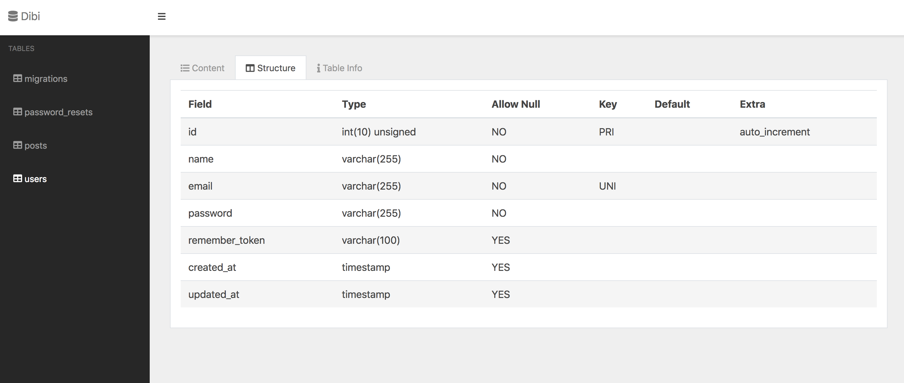

# Dibi

## Installation

You may use Composer to install Dibi into your Laravel project:

    composer require cuonggt/dibi
    
After installing Dibi, publish its assets using the vendor:publish Artisan command:

    php artisan vendor:publish --provider="Cuonggt\Dibi\DibiServiceProvider"
    
## Dashboard

Dibi exposes a dashboard at `/dibi`.
